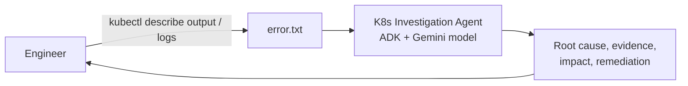
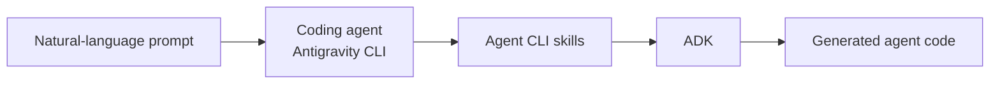
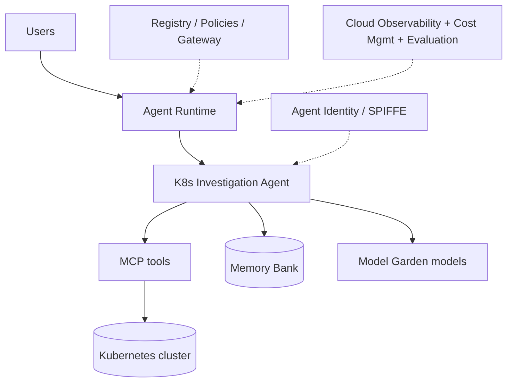
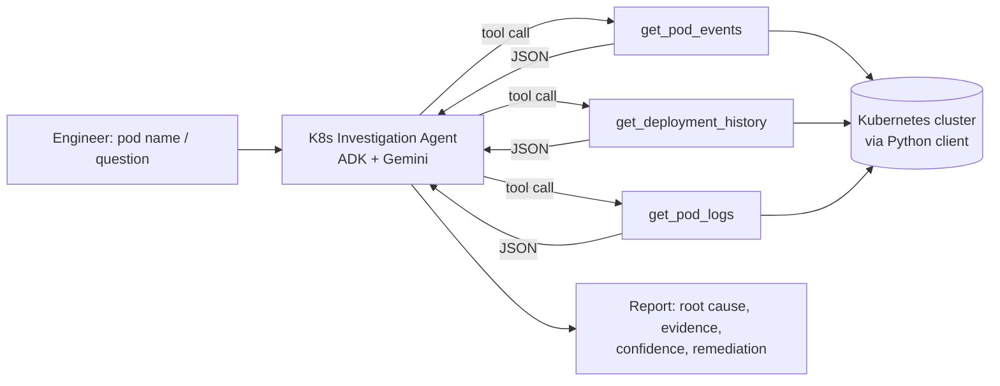

# Architecture

## v1 (Day 2): log-based investigation

```mermaid
flowchart LR
    U[Engineer] -->|kubectl describe output / logs| F[error.txt]
    F --> A[K8s Investigation Agent<br/>ADK + Gemini model]
    A --> R[Root cause, evidence,<br/>impact, remediation]
    R --> U
```

## Build-time tooling

```mermaid
flowchart LR
    P[Natural-language prompt] --> C[Coding agent<br/>Antigravity CLI]
    C --> S[Agent CLI skills]
    S --> K[ADK]
    K --> G[Generated agent code]
```

## Target architecture 

```mermaid
flowchart TB
    U[Users] --> RT[Agent Runtime]
    RT --> AG[K8s Investigation Agent]
    AG --> MCP[MCP tools] --> K8S[(Kubernetes cluster)]
    AG --> MB[(Memory Bank)]
    AG --> MG[Model Garden models]
    ID[Agent Identity / SPIFFE] -.-> AG
    GOV[Registry / Policies / Gateway] -.-> RT
    OBS[Cloud Observability + Cost Mgmt + Evaluation] -.-> RT
```

## v2 (Day 3): tool-calling investigation

```mermaid
flowchart LR
    U[Engineer: pod name / question] --> A[K8s Investigation Agent<br/>ADK + Gemini]
    A -->|tool call| T1[get_pod_events]
    A -->|tool call| T2[get_deployment_history]
    A -->|tool call| T3[get_pod_logs]
    T1 & T2 & T3 --> C[(Kubernetes cluster<br/>via Python client)]
    T1 & T2 & T3 -->|JSON| A
    A --> R[Report: root cause, evidence,<br/>confidence, remediation]
```
